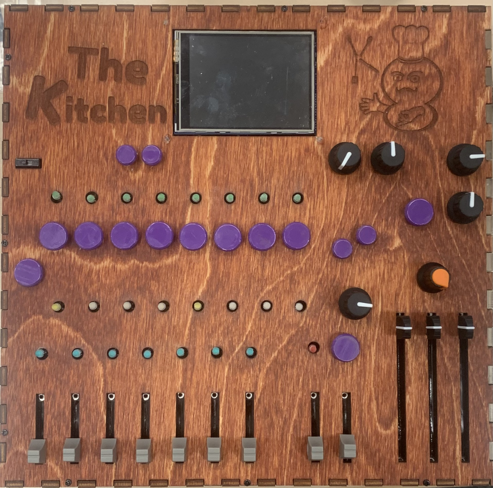
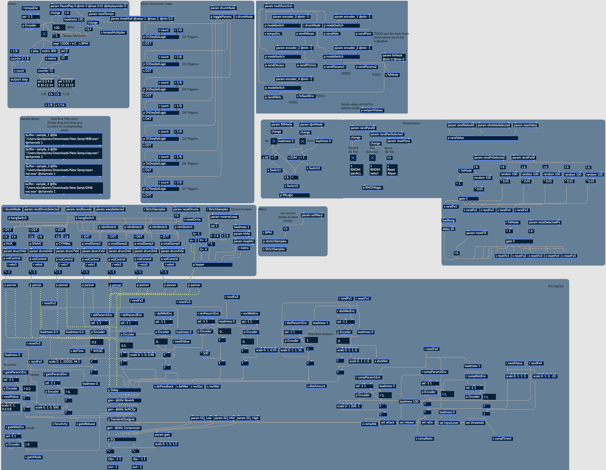
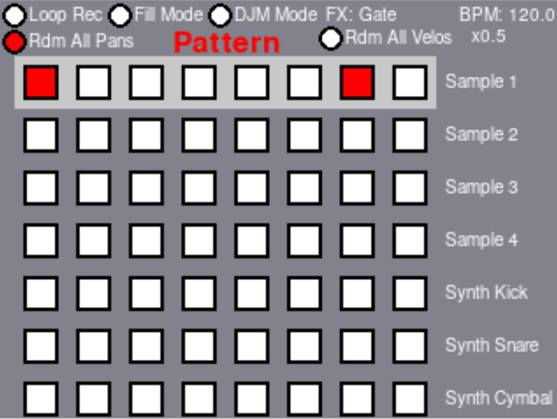
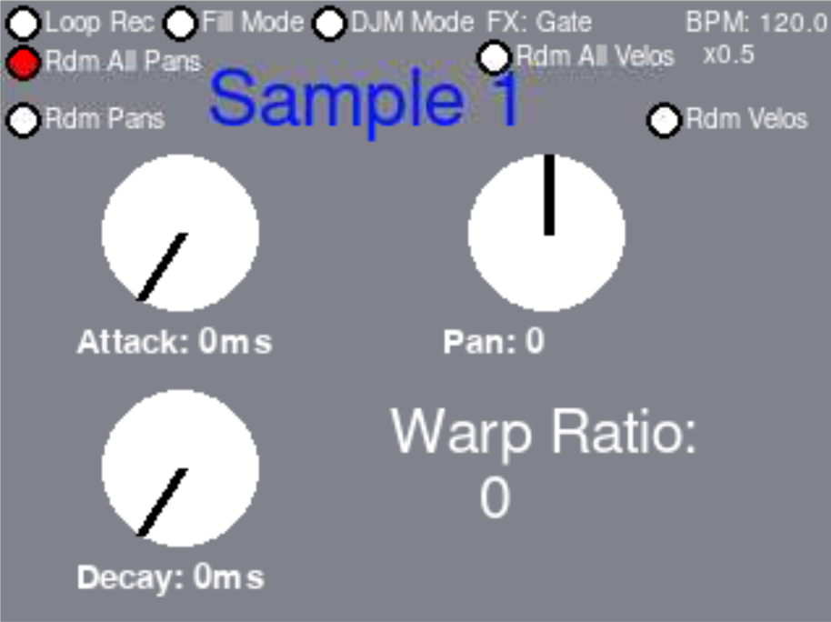
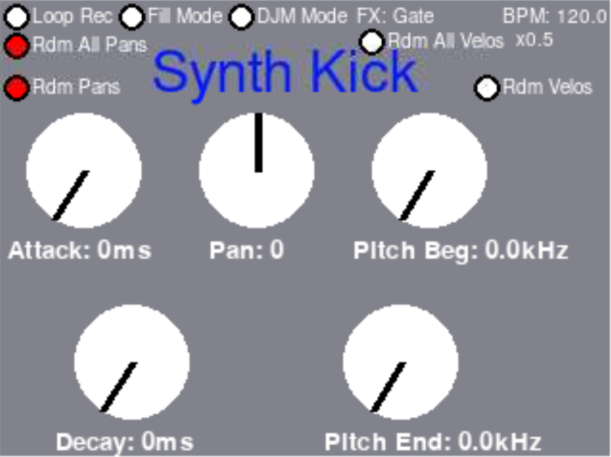
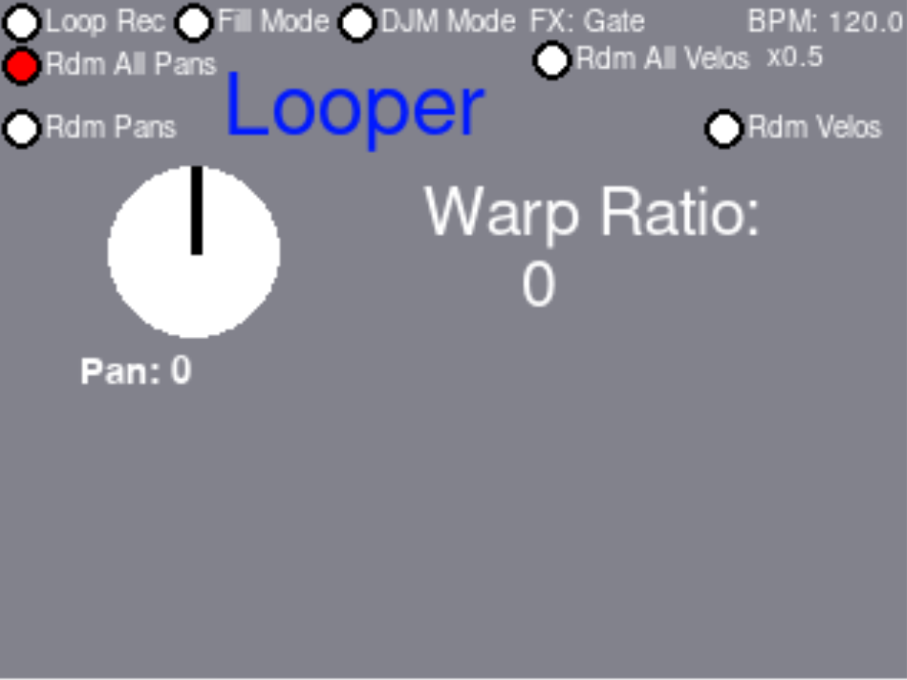
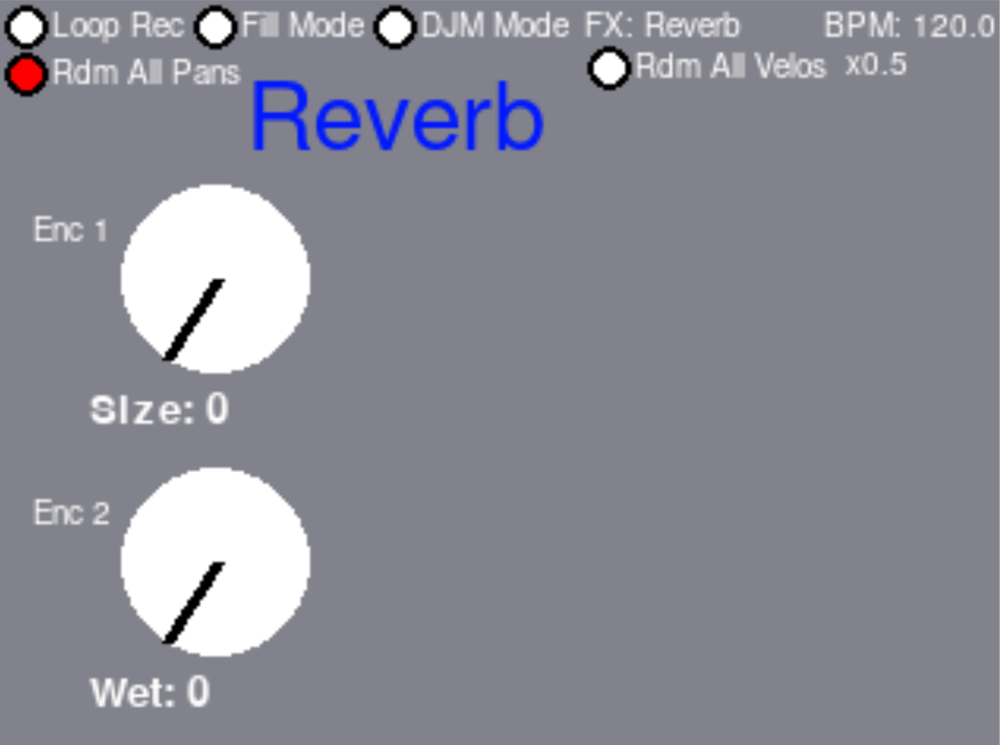

# The Kitchen

## A Microcontroller-based drum machine and feedback looper built using RNBO embedded on a Raspberry Pi.
This repo contains all the firmware and hardware for the instrument. This instrument was built as a Capstone project at Georgia Tech. The designers were David Jones, Ryan Ortwein, and Joe Walker. 

Our goal was to prove the efficacy of RNBO as a development environment for complex musical instruments. As far as we know, this is the furthest that RNBO has been pushed since its release in 2022. We believe that projects like ours could be the future of music instrument design. 

## [link to demo video](https://youtu.be/1aXgyqzfzg8)

## The firmware on the Pi can be found [here](https://github.com/DavidJones10/The-Kitchen-Firmware)

## Final Enclosure Design

## RNBO Patch
#### We pushed RNBO to its maximum, at one point reaching the maximum number of UI objects before RNBO began to crash. Here is an image of our final RNBO patcher: 

## TFT Display
#### We used a tft screen for our display. We used the fbtft overlay for SPI-connected displays using the fbtft drivers. Our screen used the ili9341 controller. Helpful info on how to set up this screen with the pi can be found in the "TFT screen config steps.rtf" file in the "Raspi Firmware" directory.

#### We used pygame to build our UI. Here are some pictures:

